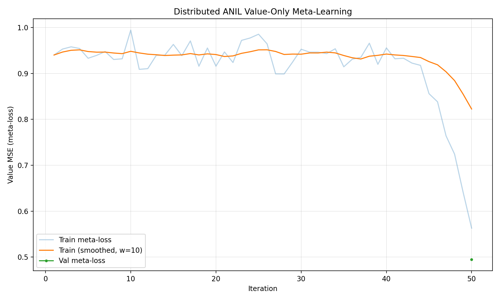

# MAML Value-Only ANIL — Results

> Auto-generated. Updated each validation step.

## Config
```
bottleneck_dim=64
ckpt_every=500
data_dir=/tmp/maml-chess/processed_chess_flat
db_path=None
head_params=4225
inner_lr=0.005
inner_steps=5
k_query=16
k_support=16
max_actors=25
max_grad_norm=5.0
max_hours=24.0
meta_batch_size=128
meta_iters=5000
min_positions=32
n_actors=25
n_channels=45
out_dir=./runs/game_task_v1
outer_lr=0.0003
ray_address=ray://127.0.0.1:10001
seed=42
task_mode=game
total_params=472833
train_frac=0.8
trunk_hidden=64
val_every=50
val_tasks=128
value_hidden=64
```

## latest.pt
- Iteration: 50
- Best val meta-loss: 0.4949
- Latest train meta-loss: 0.5630
- Train loss range (last 50): 0.5630 – 0.9944
- Latest val meta-loss: 0.4949
- Val loss range (last 10): 0.4949 – 0.4949

## best.pt
- Iteration: 50
- Best val meta-loss: 0.4949
- Latest train meta-loss: 0.5630
- Train loss range (last 50): 0.5630 – 0.9944
- Latest val meta-loss: 0.4949
- Val loss range (last 10): 0.4949 – 0.4949

## Loss Curve


## Console Log (last 30 of 201 lines)
```
[it    60] meta_loss=0.1439 | 28741ms | 1730s
[it    61] meta_loss=0.1465 | 28487ms | 1759s
[it    62] meta_loss=0.4227 | 28833ms | 1788s
[it    63] meta_loss=0.3632 | 28674ms | 1816s
[it    64] meta_loss=0.1544 | 27910ms | 1844s
[it    65] meta_loss=0.1067 | 27864ms | 1872s
[it    66] meta_loss=0.0851 | 27860ms | 1900s
[it    67] meta_loss=0.0910 | 28525ms | 1928s
[it    68] meta_loss=0.0782 | 28496ms | 1957s
[it    69] meta_loss=0.0583 | 28465ms | 1985s
[it    70] meta_loss=0.0746 | 28471ms | 2014s
[it    71] meta_loss=0.0810 | 28065ms | 2042s
[it    72] meta_loss=0.0935 | 28459ms | 2070s
[it    73] meta_loss=0.0715 | 28533ms | 2099s
[it    74] meta_loss=0.0631 | 28354ms | 2127s
[it    75] meta_loss=0.0690 | 27514ms | 2155s
[it    76] meta_loss=0.0852 | 28599ms | 2183s
[it    77] meta_loss=0.1055 | 28469ms | 2212s
[it    78] meta_loss=0.1481 | 28235ms | 2240s
[it    79] meta_loss=0.1536 | 28641ms | 2269s
[it    80] meta_loss=0.1819 | 28684ms | 2297s
[it    81] meta_loss=0.2455 | 28509ms | 2326s
[it    82] meta_loss=0.2546 | 27775ms | 2354s
[it    83] meta_loss=0.2727 | 28413ms | 2382s
[it    84] meta_loss=0.3270 | 28220ms | 2410s
[it    85] meta_loss=0.3348 | 28124ms | 2439s
[it    86] meta_loss=0.3939 | 28441ms | 2467s
[it    87] meta_loss=0.4050 | 28674ms | 2496s
[it    88] meta_loss=0.5826 | 28577ms | 2524s
[it    89] meta_loss=0.6864 | 28007ms | 2552s
```
